## Make sure whole grid infection is equal to mass action model

For duration of infection = 2 timesteps
Calculated probability of infection from R0

| | |
:---:|:---:|:---:|
R0 | 
20 |  |  |
10 |  |  |
5 | 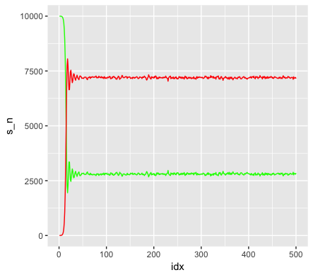 | 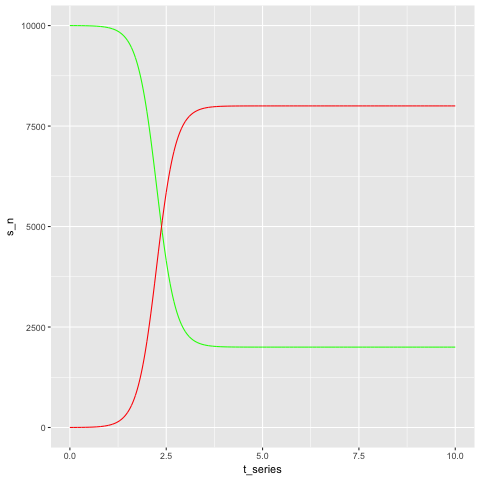 |
4 | 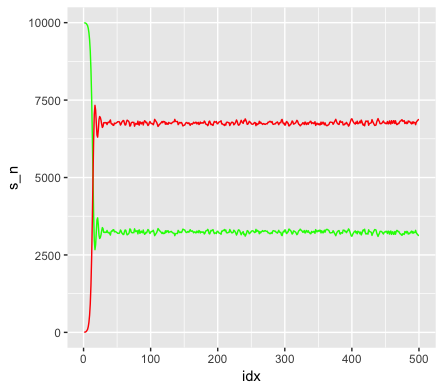 | 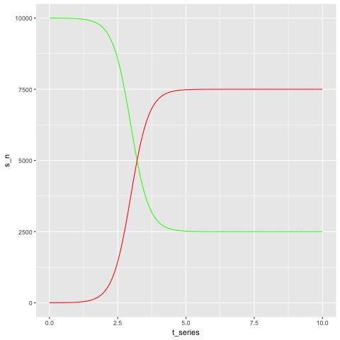 |
3 | 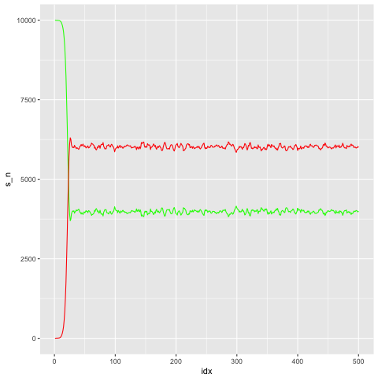 | 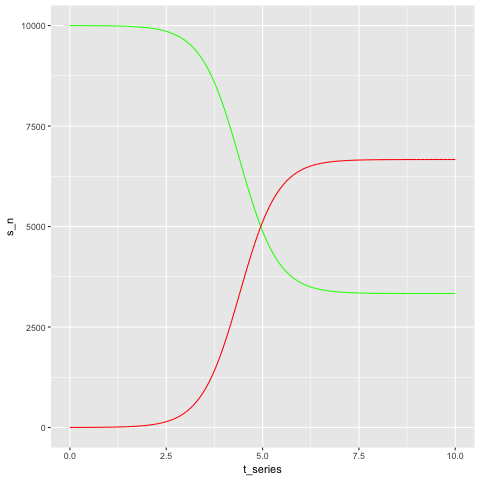 |
2 | 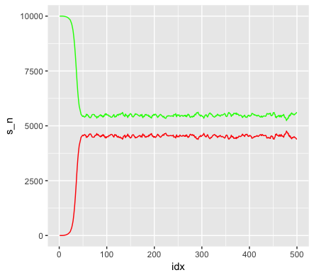 | 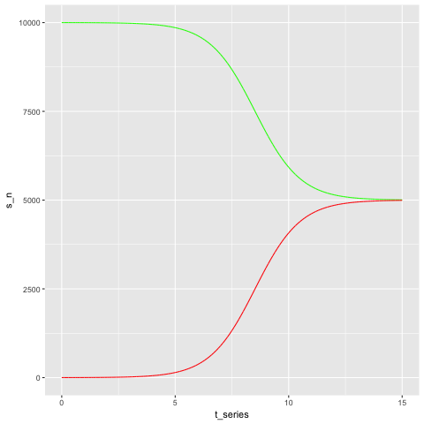 |

## How calcInfect works

### Main idea
1.) Calculate the probability of infection for all points based on it's neighbors. 

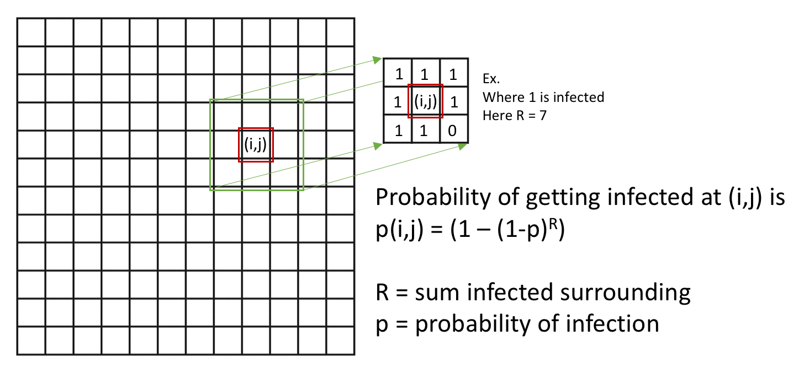

2.) From that probability of infection grid, compare with uniform random grid. If probability of infection passes (more than) random roll, then count as infected.

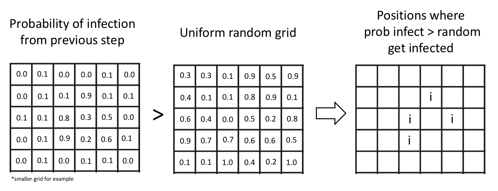

### Transversing the array & non-square shaped kernels
From the main idea, this can be done using convolution with a flat kernel. Specifically to find R which is dependent on it's neighbors. Masking can also be done here we want a Neumann neighborhood.

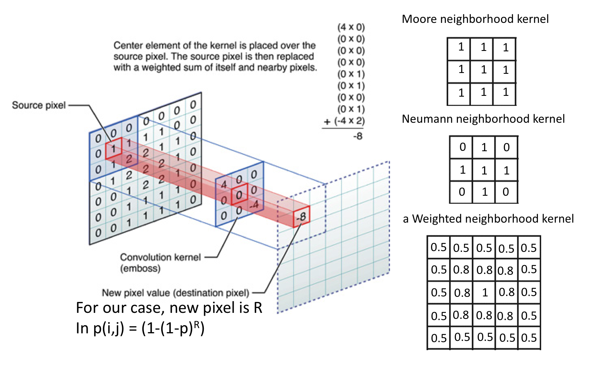
 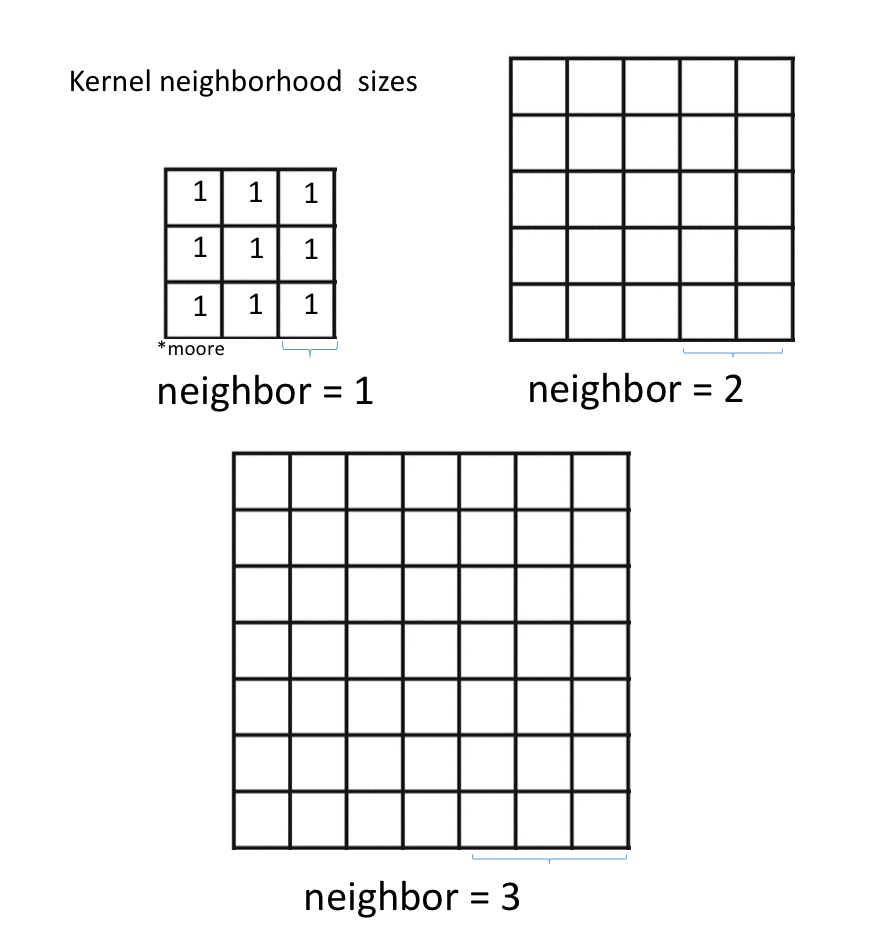

### Handling edges
On the edges and corners, using typical indexing would result in a out-of-bound error. To handle these cases, consider movement on x axis. Since x, y are independent of each other, same calculations would work for y axis using j index instead of i.

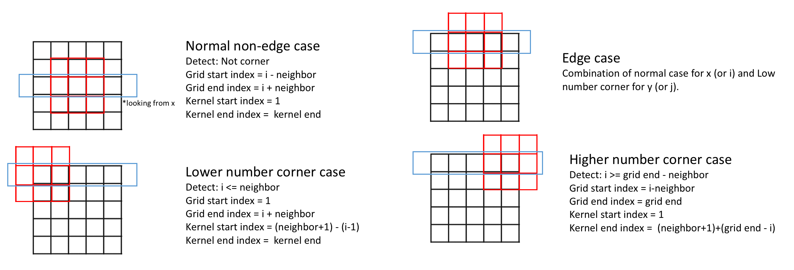

### Handling kernels larger than the grid
Next, consider that kernels may be large than the grid. So slightly different index calculations would be needed.

3 cases are considered
- Kernel size < grid size
- kernel_size > grid size AND neighbor + 1 <= grid size
- neighbor + 1 > grid size

Note: A much simpler function to test the last case scenario to compare with the mass model is in 18 June's notes.